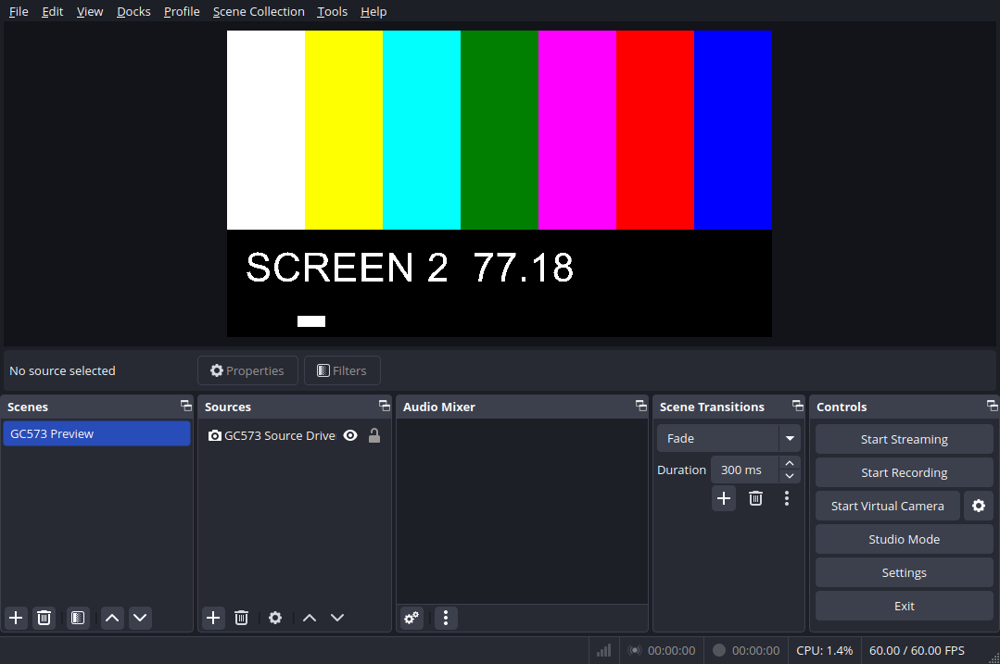
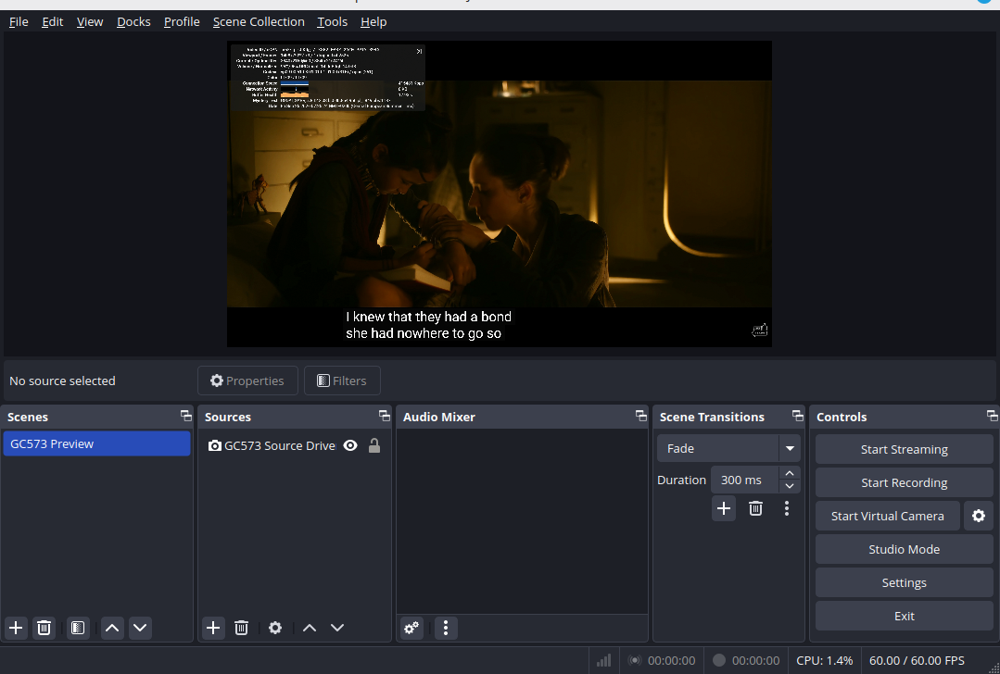
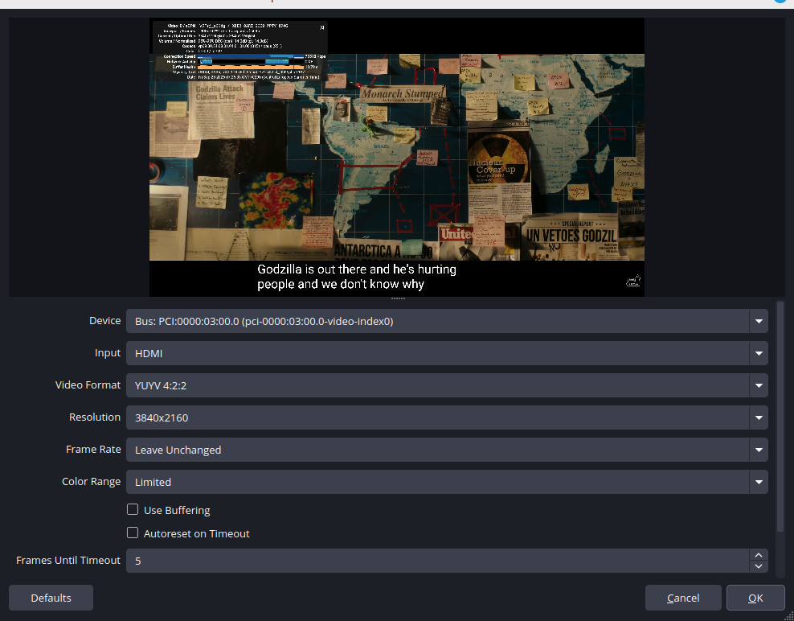

# OpenLiveGamer4K

**Hardware target: the original AVerMedia Live Gamer 4K GC573, PCI ID
`1461:0054`. This release does not support the Live Gamer 4K 2.1 or other
AVerMedia models.**

**Bringing the AVerMedia Live Gamer 4K GC573 to Linux.**

A community-built, source-only V4L2 driver for capturing HDMI video with your
GC573 (`1461:0054`), including stereo HDMI audio. Built for the community, with no vendor binary objects
needed to build or load the driver.

**4K capture · Stereo HDMI audio · Hardware scaling · OBS integration**

[Beta release notes](docs/RELEASE-NOTES.md) · [Installation](docs/INSTALL.md) · [Features](docs/FEATURES.md) ·
[Report a problem](docs/REPORTING.md) · [OBS setup](docs/OBS.md) · [Validation](docs/VALIDATION.md) ·
[Contributing](CONTRIBUTING.md)



*GC573 capture in OBS Studio during a development test on September 24, 2026,
using our original test pattern. This image shows an earlier working preview;
see the [validation record](docs/VALIDATION.md) for current test coverage.*

**0.1.0-beta2 — for community testing, not a stable release.** Hardware coverage currently
consists of one GC573 on Linux Mint 22.3, kernel 6.17.0-22-generic. Selected
SDR capture paths have passed testing; broader compatibility and long-duration
qualification remain in progress.

## Features

| Feature | Implementation and test status |
| --- | --- |
| YUYV (YUY2), NV12, BGR24, RGB24 | Color-bar checks passed at all four output sizes below with a 4K60 input |
| 4K, 1080p, 720p and 1280×800 output | Source FPGA scaling; tested from 4K60 input in all four formats |
| Native 4K60 capture | Each format completed a 300-frame run reporting 60 fps; long-duration testing pending |
| Resolution and refresh changes | Automatic recovery implemented; earlier OBS tests recovered in approximately 3–11 seconds |
| 24/23.976, 25, 30/29.97, 50, 60/59.94 Hz inputs | Selected timing families demonstrated on earlier revisions; see the detailed matrix |
| OBS integration | Concurrent V4L2 video and ALSA audio verified; maintainer confirmed picture and music capture |
| DKMS | Build/install checked on Mint 22.3; clean lifecycle, kernel-update and Secure Boot tests pending |
| HDMI audio | Stereo 48 kHz S16_LE LPCM capture through ALSA enabled by default, with an off switch in the control app. Stereo test tones and simultaneous OBS audio/video passed short tests on one card; long-term sync remains unqualified. [Details](docs/VALIDATION.md) |
| P010 and HDR | Planned; not implemented |

HDMI input currently requires RGB8. RGB24 uses a CPU channel swap; BGR24 is
native. Advertising a mode does not mean every input/output combination works.
Independent 60 Hz input to 59.94 fps output conversion remains unresolved.

Read the [detailed feature matrix](docs/FEATURES.md), [OBS setup](docs/OBS.md),
[known limitations](docs/RELEASE-NOTES.md).

## In OBS Studio

User-provided screenshots from September 25, 2026 (window title bars
cropped):



*HDMI video displayed in the dedicated GC573 Preview scene on Linux.*



*The V4L2 source configured for 3840×2160 YUYV capture. These screenshots
illustrate the OBS workflow; measured format and frame-rate results are
recorded separately in the [validation notes](docs/VALIDATION.md).*

## Build and install

Ubuntu and Linux Mint builds require headers matching the target kernel and
the usual compiler/build tools. On Linux Mint 22.3 with kernel
6.17.0-22-generic, DKMS build and system installation passed locally. Clean-VM package lifecycle,
kernel-update qualification and Secure Boot MOK enrollment/use remain pending. The installation
guide includes explicit DKMS setup and removal steps. This does not establish support across Ubuntu,
Mint, or kernel versions. See [installation notes](docs/INSTALL.md) and the
[release notes](docs/RELEASE-NOTES.md).

For a direct source build:

```sh
make -C src
```

Building does not install or load the module. Follow the installation guide
before handing the card to this beta driver.

Contributions and reproducible reports are welcome. Read
[CONTRIBUTING.md](CONTRIBUTING.md) before opening a change or issue.

## Support development

OpenLiveGamer4K is free and open source. If it's useful to you, you can help
support development and hardware testing.

**[☕ Buy me a coffee](https://buymeacoffee.com/royake)**

Testing, bug reports and contributions are equally welcome.

## People and license

Created and maintained by **Roy-Åke Martinsson** · [royake.com](https://royake.com)

Contact: <royakemartinsson@gmail.com>

Contributions, hardware reports, and documentation improvements are welcome.
See [AUTHORS.md](AUTHORS.md) for project credits and
[third-party notices](THIRD_PARTY_NOTICES.md) for upstream acknowledgements.

Licensed under **GPL-2.0-only**. See [LICENSE](LICENSE).

OpenLiveGamer4K is an independent community project, not affiliated with or
endorsed by AVerMedia. AVerMedia and Live Gamer are names of their respective
owner.

## Control app and HDMI audio

The GTK4 control app provides device status, video preview, and HDMI
audio capture enabled by default: stereo 48 kHz S16_LE LPCM through ALSA,
including simultaneous video and audio in OBS. Known stereo tones passed
capture tests, and the maintainer confirmed music capture end to end.

Stopping video or recovering HDMI can interrupt audio with an ALSA XRUN;
clients may need to restart capture. Long-duration stability and A/V
synchronization remain under qualification. Compressed surround audio and
other audio sample rates are not supported.

The audio toggle uses administrator authentication to reload an idle driver,
briefly reconnecting HDMI. It refuses busy devices and changes no boot settings.
The five-second test reports silence or nonzero activity without saving audio.
You can save a diagnostic report locally and choose whether to share it.

Matching alpha4 driver and control-app packages were installed and tested on
Mint 22.3 / kernel 6.17.0-22. Beta2 retains the capture paths, enables audio by default and adds guided issue
reporting with richer diagnostics. Native X11 and nested Wayland mock tests
have passed; native Wayland hardware preview, broader distributions and the
full package lifecycle remain unqualified.
See the [app guide](app/data/README.md) and
[validation record](docs/VALIDATION.md).
